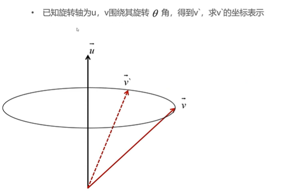
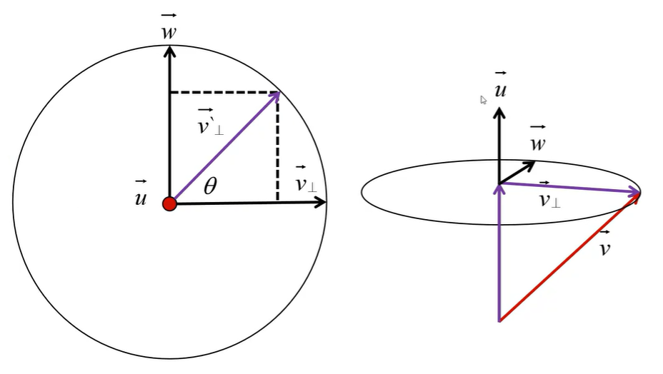

## 绕任意轴旋转公式推导
如图所示：

由图可知
$$
\left\{
\begin{aligned}

\mathbf{v}=\mathbf{v_{\perp}} + \mathbf{v_{\parallel}} \\

\mathbf{v^{\prime}}=\mathbf{v^{\prime}_{\perp}} + \mathbf{v^{\prime}_{\parallel}}

\end{aligned}
\right. \tag*{\textcircled{1}}
$$

#### 1. 求$\mathbf{v_{\perp}}$
由图可知:
$$\mathbf{v_{\parallel}}=\mathbf{v^{\prime}_{\parallel}}=(\mathbf{v} \cdot \mathbf{n} )\mathbf{v} \tag*{\textcircled{2}}$$

#### 2.求$\mathbf{v^{\prime}_{\perp}}$
从$\mathbf{n}$反方向向下看：

由图可知：
$$\mathbf{v^{\prime}_{\perp}}=\omega\cdot\sin\theta+ \mathbf{v_{\perp}}\cos\theta  \tag*{\textcircled{3}}$$
$$\mathbf{n}\times\mathbf{v_{\perp}}=\omega \tag*{\textcircled{4}}$$
整理后可得：
$$\mathbf{v^{\prime}_{\perp}}=\sin\theta\cdot(\mathbf{n}\times\mathbf{v_{\perp}}) + \cos\theta\cdot(\mathbf{v}-\mathbf{v} \cdot \mathbf{n})\mathbf{v} \tag*{\textcircled{5}}$$

#### 3.整合
$$\mathbf{v^{\prime}}=(1+\cos\theta)\cdot(\mathbf{v} \cdot \mathbf{n})\mathbf{v}+\sin\theta\cdot(\mathbf{n}\cdot\mathbf{v})+\cos\theta\cdot\mathbf{v}$$

#### 4.矩阵形式
$$
\begin{pmatrix}
a & b \\
c & d \\
\end{pmatrix}
$$
已知旋转矩阵$R=(\mathbf{r_{0}}, \mathbf{r_{1}},\mathbf{r_{2}})$,那笛卡尔坐标的基作用了R后变为
$$
\begin{pmatrix}
\mathbf{r_{0}} & \mathbf{r_{1}} & \mathbf{r_{2}} 
\end{pmatrix}
\begin{pmatrix}
1 \\
0 \\
0 \\
\end{pmatrix}
=
\mathbf{r_{0}}
$$
$$
\begin{pmatrix}
\mathbf{r_{0}} & \mathbf{r_{1}} & \mathbf{r_{2}} 
\end{pmatrix}
\begin{pmatrix}
0 \\
1 \\
0 \\
\end{pmatrix}
=
\mathbf{r_{1}}
$$
$$
\begin{pmatrix}
\mathbf{r_{0}} & \mathbf{r_{1}} & \mathbf{r_{2}} 
\end{pmatrix}
\begin{pmatrix}
0 \\
0 \\
1 \\
\end{pmatrix}
=
\mathbf{r_{2}}
$$
带入表达式整理可得
$$
R=
\begin{pmatrix}
\mathbf{n_{x}}^{2}(1-\cos\theta)+\cos\theta && \mathbf{n_{x}}\mathbf{n_{y}}(1-\cos\theta)-\mathbf{n_{z}}\cdot\sin\theta && \mathbf{n_{x}}\mathbf{n_{z}}(1-\cos\theta)+\mathbf{n_{y}}\cdot\sin\theta\\
\mathbf{n_{x}}\mathbf{n_{y}}(1-\cos\theta)+\mathbf{n_{z}}\cdot\sin\theta && \mathbf{n_{y}}^{2}(1-\cos\theta)+\cos\theta && \mathbf{n_{y}}\mathbf{n_{z}}(1-\cos\theta)-\mathbf{n_{x}}\cdot\sin\theta\\
\mathbf{n_{x}}\mathbf{n_{z}}(1-\cos\theta)-\mathbf{n_{y}}\cdot\sin\theta && \mathbf{n_{y}}\mathbf{n_{z}}(1-\cos\theta)+\mathbf{n_{x}}\cdot\sin\theta && \mathbf{n_{z}}^{2}(1-\cos\theta)+\cos\theta\\
\end{pmatrix}
$$